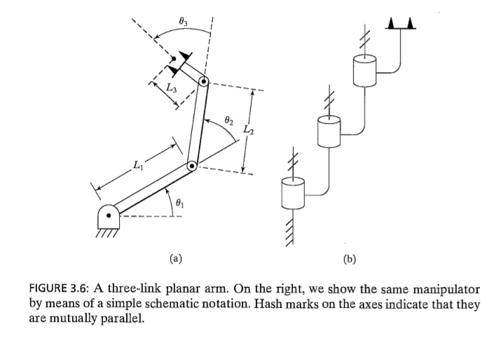
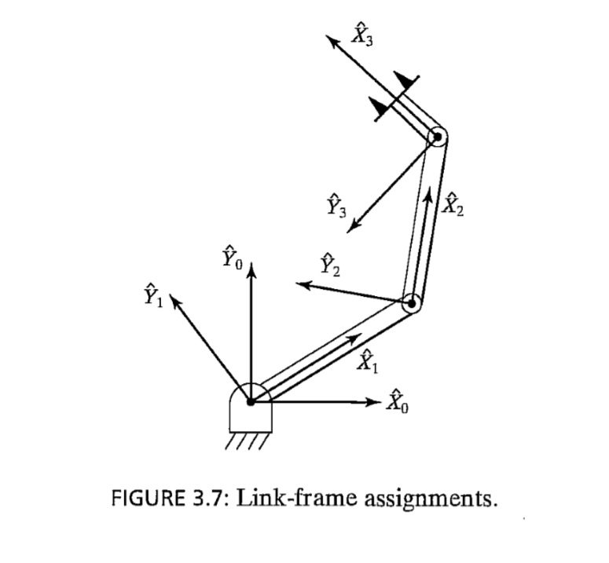
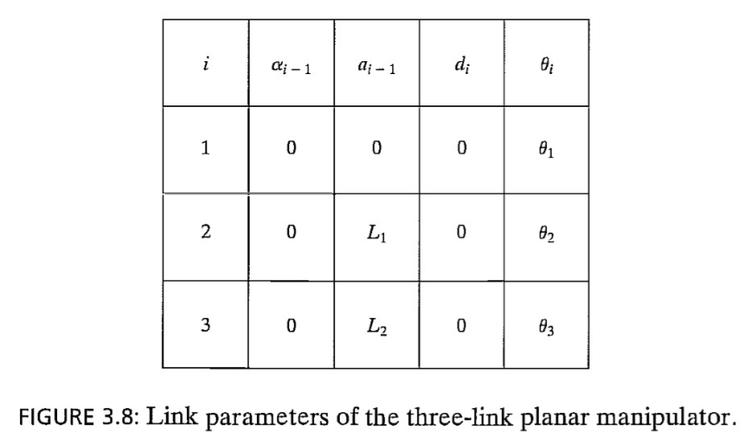

## Chapter 3 Exersices

This exercise focuses on DII parameters and on the forward-pose (position and orientation) kinematics transformation for the planar 3-DOF, 3R robot (of Figures 3.6 and 3.7). The following fixed-length parameters are given: **L1 = 4**, **L7 = 3**, and **L3 = 2** (m).

*Figure 3.6*

*Figure 3.7*

*Figure 3.8*

## Exercises
a) Derive the DH parameters. You can check your results against Figure 3.8.

b) Derive the neighboring homogeneous transformation matrices (i-1, i)T, i = 1, 2, 3. These are functions of the joint-angle variables θi, i = 1, 2, 3. Also, derive the constant (3, H)T by inspection: The origin of {H} is in the center of the gripper fingers, and the orientation of {H} is always the same as the orientation of {3}.

c) Use Symbolic MATLAB to derive the forward-pose kinematics solution (0 ,3)T and (0, H)T symbolically (as a function of θi) Abbreviate your answer, using s*i* = sin(θi) , c*i* = cos(θi), and so on. Also, there is (θ1 + θ2 + θ3) simplification, by using sumof-angle formulas, that is due to the parallel Zi axes. Calculate the forward-pose kinematics results (both (0, 3)T and (0, H)T via MATLAB for the following input cases:

i)   Θ = {θ1 θ2 θ3}T = {0 0 0}T

ii)  Θ = {10deg 20deg 30deg}T

iii) Θ = {θ1 θ2 θ3}T = {0 0 0}T

For all three cases, check your results by sketching the manipulator configuration and deriving the forward-pose kinematics transformation by inspection. (Think of the definition of °HT in terms of a rotation matrix and a position vector.) Include frames {H}, {3), and {0} in your sketches.

d) Check all your results by means of the Corke MATLAB Robotics Toolbox. Try functions link() , robotQ, and fkineQ.